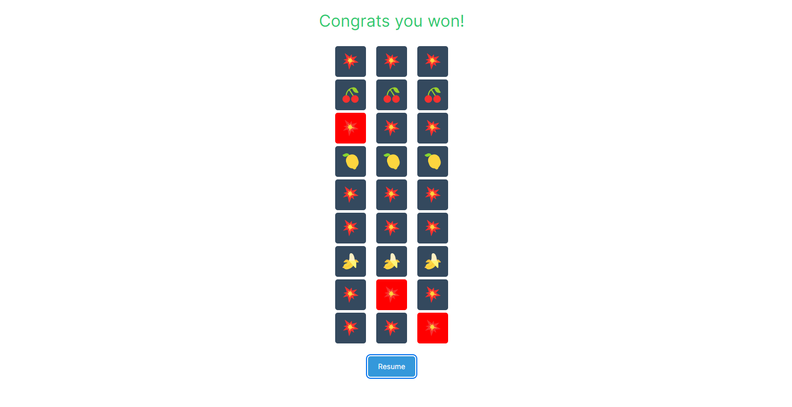

# 🎰 React Slot Machine Game

Welcome to the React Slot Machine Game! This project simulates a classic slot machine using React and NextUI. Test your luck and see if you can match the emojis to win!

## 🚀 Features
- **Real-time Emulation**: Emulates a spinning slot machine reels with randomized emojis.
- **Interactive Controls**: Pause and resume the spinning animation.
- **Winning Detection**: Displays a message if all three emojis match.

## 🛠️ Technologies Used
- **React**: JavaScript library for building user interfaces.
- **NextUI**: React UI library to create beautiful and modern web applications.

## 📝 How to Play

1. Press the **Pause** button to stop the spinning.
2. Check if all three reels display the same emoji.
3. If they match, you win! Otherwise, try again.

## 📸 Screenshot


## 📚 How to Run the Project

1. **Clone the repository**:
    ```bash
    git clone https://github.com/yourusername/react-slot-machine-game.git
    cd react-slot-machine-game
    ```

2. **Install dependencies**:
    ```bash
    npm install
    ```

3. **Run the development server**:
    ```bash
    npm run dev
    ```

4. **Open** `http://localhost:3000` in your browser to play the game.

## 💡 Contributions

Feel free to open issues or submit pull requests for improvements and new features. Let's make this project better together!

## 📧 Contact Support 

For inquiries, assistance, or feedback, reach out to us at [er.anup.bhattarai@gmail.com](mailto:er.anup.bhattarai@gmail.com). We value your input and strive to provide prompt support.

## 🌟 Acknowledgements
- **NextUI** for the beautiful components.
- **React** for the robust library.

---

Happy Spinning and Good Luck! 🎉
